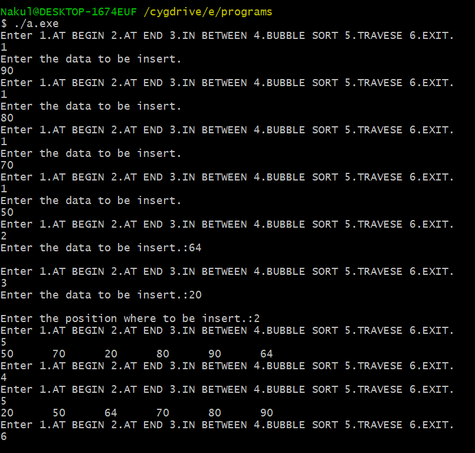

# BubbleSort

 Bubble Sort on Doubly Linked List.

## Source code:

```C
#include<stdio.h>
#include<stdlib.h>
void insert();
void ibegin();
void ibet();
void iend();
void sort();
void print();
int m;
struct node
{
	int data;
	struct node* lp;
	struct node* rp;
}*START=NULL;
void main()
{
	insert();
}
//INSERTION
void insert()
{
	do
	{
		printf("Enter 1.AT BEGIN 2.AT END 3.IN BETWEEN 4.BUBBLE SORT 5.TRAVESE 6.EXIT.\n");
		scanf("%d",&m);
		switch(m)
		{
			case 1:ibegin();break;
			case 2:iend();break;
			case 3:ibet();break;
			case 4:sort();break;
			case 5:print();break;
		}
	}while(m!=6);
}
//INSERTION AT BEGIN
void ibegin()
{
	struct node *temp;
	int d;
	printf("Enter the data to be insert.\n");
	scanf("%d",&d);
	temp=(struct node*)malloc(sizeof(struct node));
	temp->data=d;
	if(START==NULL)
	{
		temp->lp=NULL;
		temp->rp=NULL;
	}
	else
	{
		temp->lp=NULL;
		temp->rp=START;
		START->lp=temp;
	}
	START=temp;	
}
//INSERTION AT END
void iend()
{
	struct node *temp,*t;
	int d;
	printf("Enter the data to be insert.:");
	scanf("%d",&d);
	printf("\n");
	temp=(struct node*)malloc(sizeof(struct node));
	temp->data=d;
	temp->rp=NULL;
	if(START==NULL)
	{
		temp->rp=NULL;
		temp->lp=NULL;
		START=temp;
	}
	else
	{
		t=START;
		while(t->rp!=NULL)
		{
			t=t->rp;
		}
		temp->lp=t;
		t->rp=temp;
	}
}
//INSERTION IN BETWEEN
void ibet()
{
	struct node *temp,*t;
	int d,p,k=0;
	printf("Enter the data to be insert.:");
	scanf("%d",&d);
	printf("\nEnter the position where to be insert.:");
	scanf("%d",&p);
	temp=(struct node*)malloc(sizeof(struct node));
	temp->data=d;
	t=START;
	while((k<p-1)&&(t!=NULL))
	{
		t=t->rp;
		k++;
	}
	if((k<p)&&(t!=NULL))
	{
		temp->rp=t->rp;
		temp->lp=t;
		(t->rp)->lp=temp;
		t->rp=temp;
	}
	else
	printf("Position not found.\n");
}
//TRAVESING
void print()
{
	struct node *t;
	t=START;
	while(t!=NULL)
	{
		printf("%d\t",t->data);
		t=t->rp;
	}
	printf("\n");
}
//BUBBLE SORT
void sort()
{
	struct node *t,*s;
	int flag;
	t=START;
	do
	{
		flag=0;t=START;
		while(t->rp!=NULL)
		{
			if(t->data>(t->rp)->data)
			{
				s=t->data;
				t->data=(t->rp)->data;
				(t->rp)->data=s;
			    flag=1;
			}
			t=t->rp;
		}
	}while(flag!=0);
}
```
**You can see the execution flow of the program below.**

## Output:

</img>
